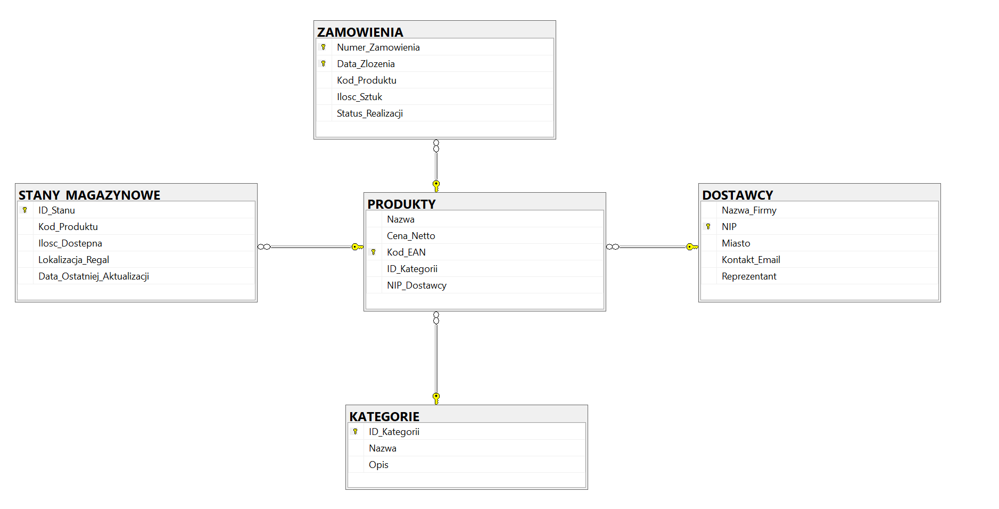

# SQL-Magazyn-ERP-PL

# Mini-System Magazynowy (ERP Lite)

## O projekcie
Projekt ten to funkcjonalna baza danych SQL stworzona do celów edukacyjnych i treningowych. Służy ona do nauki pisania złożonych zapytań i analizy danych.

**W folderze `exercises` znajdują się zadania oraz gotowe skrypty z rozwiązaniami, które wykonuję na tej bazie danych, aby doskonalić swoje umiejętności analityczne.**

**Kluczowe informacje:**
* **Geneza:** Projekt bazuje na strukturze bazy danych "SZKOŁA", którą tworzyłem podczas studiów. Została ona przerobiona na system typu ERP Lite (zarządzanie magazynem).
* **Dane:** Rekordy i dane testowe zostały wygenerowane przy użyciu AI, co pozwoliło na stworzenie bogatego zbioru danych do testowania zapytań (ponad 50 rekordów, powtarzające się kategorie, marki i miasta).
* **Język:** Całość projektu (nazewnictwo tabel, kolumn oraz opis) jest w języku polskim ze względu na lokalne zastosowanie.

## Struktura bazy danych
Baza składa się z następujących tabel:
* `KATEGORIE` – grupy produktów.
* `DOSTAWCY` – informacje o firmach dostarczających towar.
* `PRODUKTY` – katalog towarów z przypisanymi cenami i kodami EAN.
* `STANY_MAGAZYNOWE` – informacja o ilościach i fizycznej lokalizacji towaru (regały).
* `ZAMOWIENIA` – historia operacji magazynowych i sprzedaży.

### Schemat relacji (ERD)

---

# Mini-Warehouse Management System (ERP Lite) - English Version

## About the Project
This project is a functional SQL database created for educational and training purposes. It serves as a testing ground for learning how to write complex queries and perform data analysis.

**The `exercises` folder contains tasks and ready-to-use solution scripts that I perform on this database to improve my analytical skills.**

**Key Information:**
* **Origin:** The project is based on the "SCHOOL" database structure created during my university studies. It has been redesigned into an ERP Lite system (warehouse management).
* **Data:** Test records and data were generated using AI, creating a rich dataset for query testing (50+ records, recurring categories, brands, and cities).
* **Language:** The entire project (table names, columns, and descriptions) is in Polish due to its local application and university context.

## Database Structure
The database consists of the following tables:
* `KATEGORIE` – Product categories.
* `DOSTAWCY` – Information about companies supplying goods.
* `PRODUKTY` – Product catalog with prices and EAN codes.
* `STANY_MAGAZYNOWE` – Information on quantities and physical warehouse locations (racks).
* `ZAMOWIENIA` – History of warehouse operations and sales.

### Relationship Schema (ERD)

